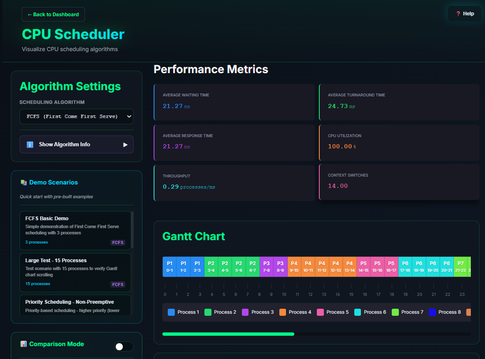
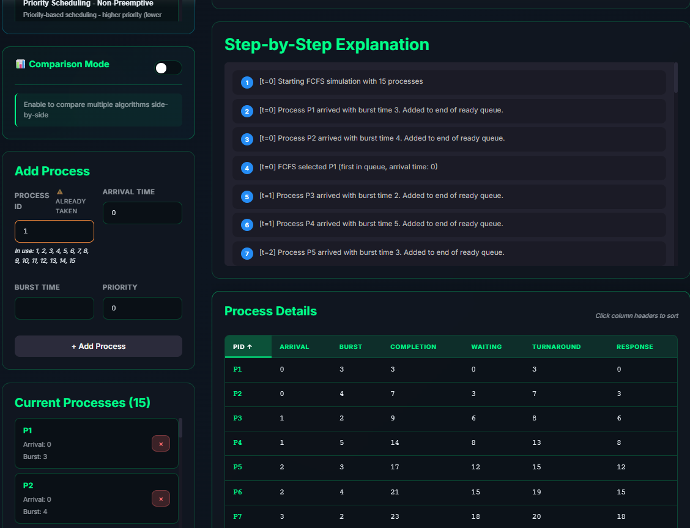
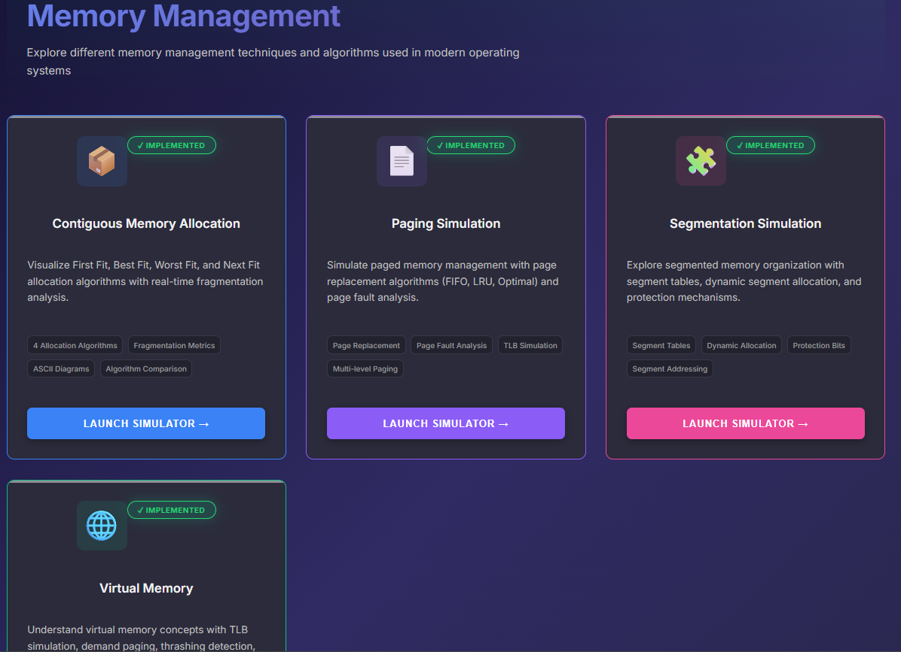
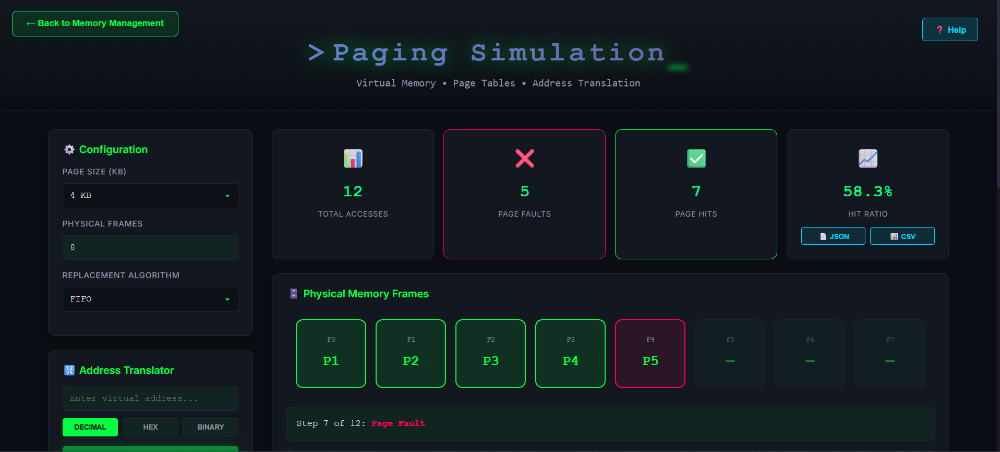
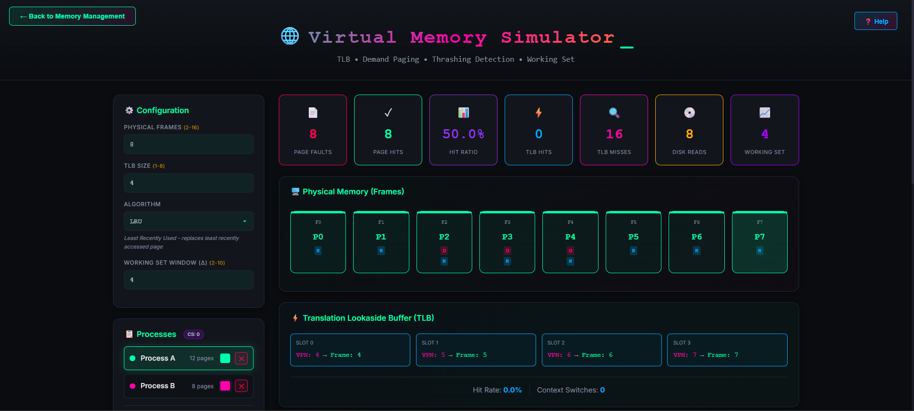
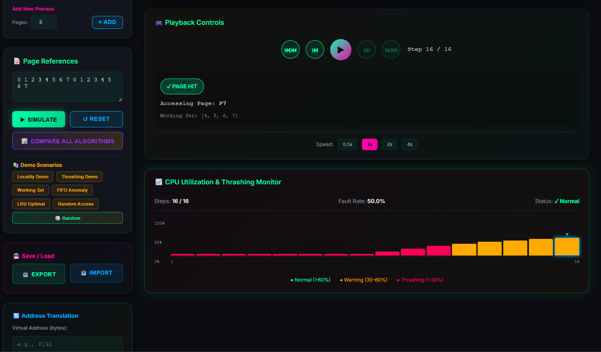
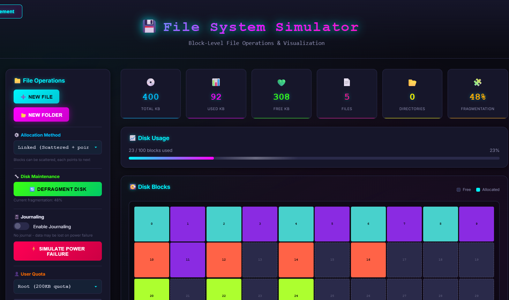
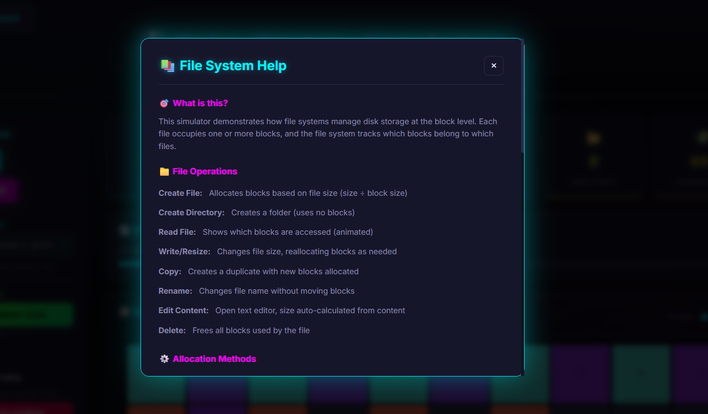

# Screenshots

Visual gallery of the OS Simulator Web App showcasing all modules and features.

---

## Dashboard

**Main Dashboard** - The central navigation hub of the OS Simulator featuring:

- Quick access cards for CPU Scheduler, Memory Management, and File System modules
- Feature highlights including Real-time Visualization, Educational Explanations, Performance Metrics, and Custom Scenarios
- Clean, modern dark theme with neon accents

---

## CPU Scheduler Module

### Gantt Chart & Metrics

**CPU Scheduler Visualization** - Demonstrates FCFS (First Come First Serve) scheduling:

- Interactive Gantt chart showing process execution timeline with color-coded processes
- Real-time performance metrics: Average Waiting Time (21.27ms), Turnaround Time (24.73ms), CPU Utilization (100%)
- Algorithm settings panel with demo scenarios
- Comparison mode toggle for algorithm analysis

### Process Details & Explanations

**Step-by-Step Explanation Panel** - Educational view showing:

- Detailed simulation logs explaining each scheduling decision
- Process details table with sortable columns (PID, Arrival, Burst, Completion, Waiting, Turnaround, Response times)
- Add Process form for custom process creation
- Current processes list with real-time updates

---

## Memory Management Module

### Module Overview

**Memory Management Hub** - Navigation page with four sub-modules:

- **Contiguous Memory Allocation** - First Fit, Best Fit, Worst Fit, Next Fit algorithms
- **Paging Simulation** - Page replacement with FIFO, LRU, Optimal algorithms
- **Segmentation Simulation** - Segment tables and dynamic allocation
- **Virtual Memory** - TLB simulation and thrashing detection

---

## Paging Simulator

**Paging Simulation Interface** - Page replacement visualization featuring:

- Configuration panel for page size, physical frames, and replacement algorithm
- Statistics display: Total Accesses (12), Page Faults (5), Page Hits (7), Hit Ratio (58.3%)
- Physical Memory Frames visualization showing current page-to-frame mapping
- Address translator with decimal, hex, and binary support
- Step-by-step simulation controls

---

## Virtual Memory Simulator

### Main Interface

**Virtual Memory Simulation** - Comprehensive VM visualization:

- TLB (Translation Lookaside Buffer) simulation with hit/miss tracking
- Physical Memory Frames display with process color coding
- Multi-process support (Process A, Process B) with separate page tables
- Statistics: Page Faults (8), Page Hits (8), Hit Ratio (50.0%), TLB Hits (0), Disk Operations

### Thrashing Detection

**CPU Utilization & Thrashing Monitor** - Advanced VM features:

- Playback controls for step-by-step simulation
- Page reference string input and working set visualization
- Real-time CPU utilization graph with color-coded zones (Normal/Warning/Thrashing)
- Demo scenarios: Locality Demo, Thrashing Demo, Working Set, FIFO Anomaly
- Export/Import functionality for saving simulation states

---

## File System Simulator

### Block Allocation Visualization

**File System Interface** - Block-level storage visualization:

- Disk statistics: Total (400KB), Used (92KB), Free (308KB), Files (5), Fragmentation (48%)
- Visual disk blocks grid with color-coded file allocations
- File operations panel (New File, New Folder)
- Allocation method selector (Linked, Contiguous, Indexed)
- Defragmentation tool and journaling toggle
- User quota management

### Help & Documentation

**Built-in Help System** - In-app documentation showing:

- File operations guide (Create, Read, Write, Copy, Rename, Delete)
- Allocation methods explanation
- Interactive help accessible from any module via the Help button

---

## Theme & Design

The OS Simulator features a **Matrix-inspired dark theme** with:

- Neon cyan, magenta, and green accent colors
- Glassmorphism card effects
- Smooth animations using Framer Motion
- Responsive design for various screen sizes
- Consistent iconography across modules
